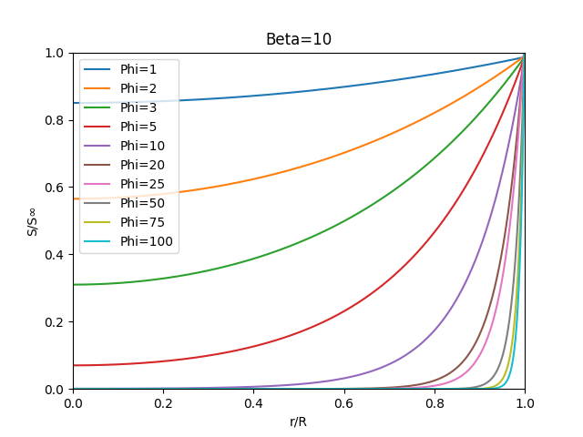
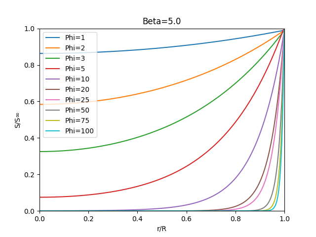
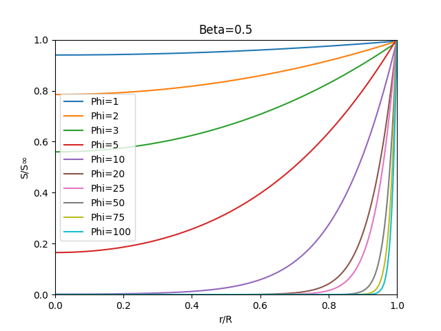
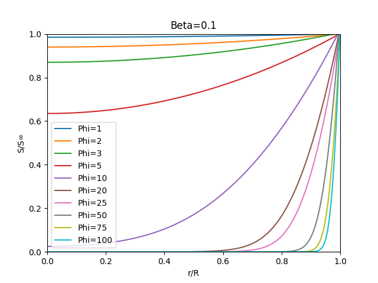
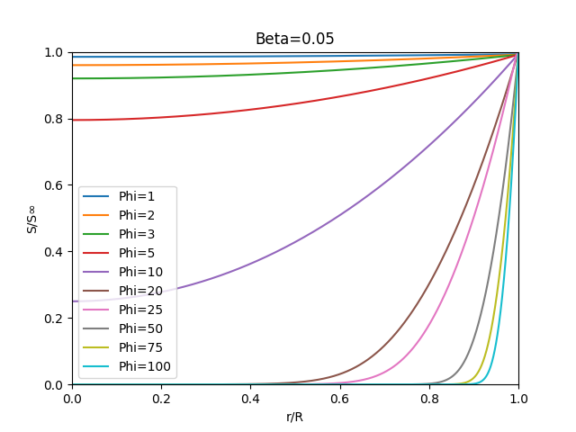
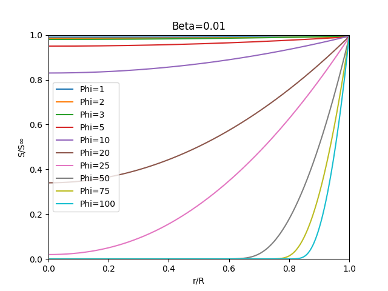

<h1 align="center">Taller 5</h1>

Nicolas Puentes Urrego

---

<h3 align="center">Transferencia simultánea de masa & reacción bioquímica en el soporte esférico</h1>
A continuación se muestra la ecuación diferencial que representa la transferencia simultanea de masa y reacción química dentro del biocatalizador enzimático, donde:

<!-- $$
\begin{equation}\tag{1}
\frac{d^{2} S}{dr^{2}} +\frac{dS}{dr}\frac{2}{r} -\phi ^{2}\frac{\beta *S}{\beta +S} =0
\end{equation}
$$ --> 

Para poder hallar la distribución se utiliza la siguiente distribución con tablas, donde: 

Se puede ver en la tabla que se supone un valor de  (naranja)y se modifica hasta que el valor en  sea igual a 1.

Para hacer lo anterior se definen los siguientes invervalos de  , donde:

Para poder realizar el calculo se definió un 

Para calcular lo anterior se realizó un algoritmo en *Python*. El código se
encuentra en el siguiente link:

[https://github.com/NicoMosty/Catalizador-Enzimatico](https://github.com/NicoMosty/Catalizador-Enzimatico)

Los resultados se muestran a continuación:

