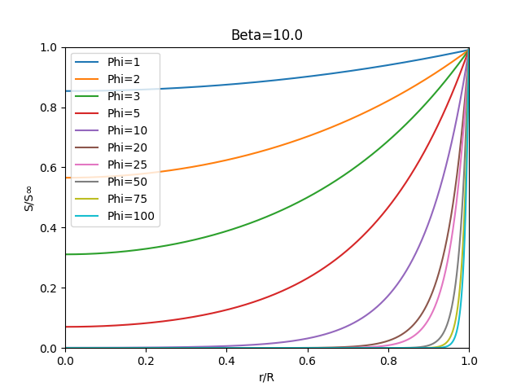
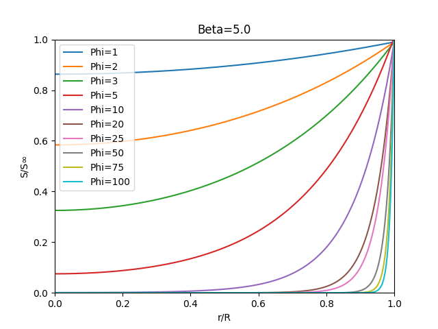
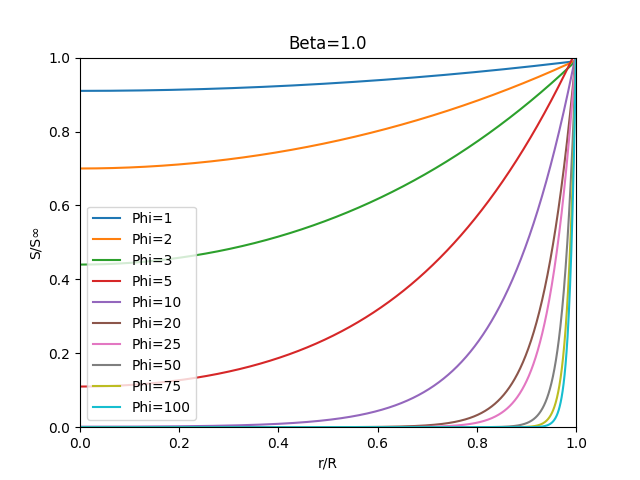
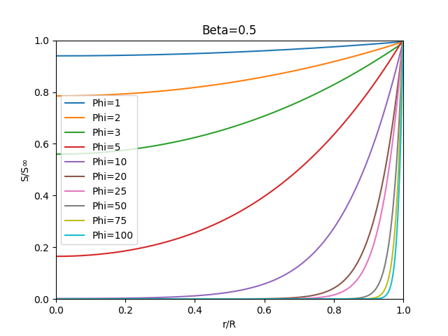
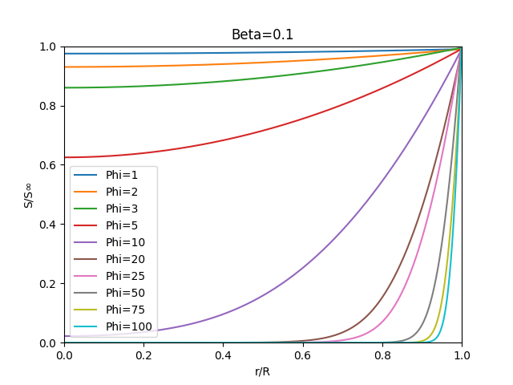
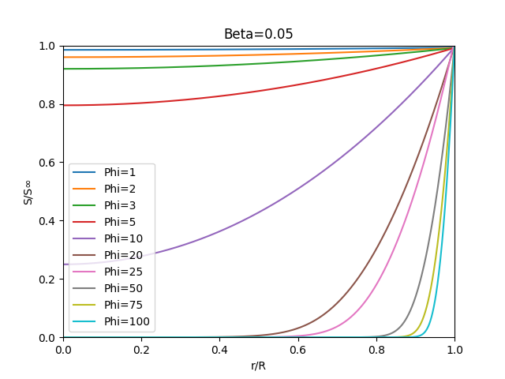
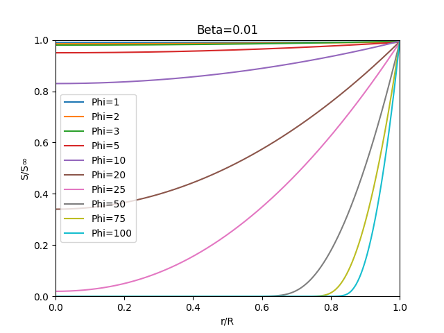
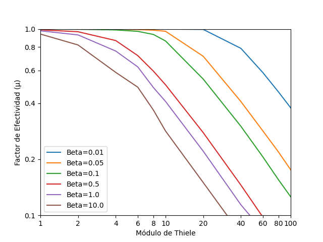

<h1 align="center">
    Transferencia simultánea de masa & reacción bioquímica en el soporte esférico
</h1>

A continuación se muestra la ecuación diferencial que representa la transferencia simultanea de masa y reacción química dentro del biocatalizador enzimático, donde:

Para el caso del radio inicial 

Para poder hallar la distribución se utiliza la siguiente distribución con tablas, donde: 

Se puede ver en la tabla que se supone un valor de  (naranja)y se modifica hasta que el valor en  sea igual a 1.

Para hacer lo anterior se definen los siguientes invervalos de  , donde:

Para poder realizar el calculo se definió un 

Para calcular lo anterior se realizó un algoritmo en *Python*. El código se
encuentra en el siguiente link:

<a href="SvsR.py">
    

        Programa en Python (Concentración Sustrato vs Radio)
    

</a>

    El programa se llama SvsR.py.py

Los resultados se muestran a continuación:

---

<h4 align="center">
    Cálculo del Factor de Efectividad (μ)
</h1>
 
 Para el calculo del factor de efectividad se tiene la siguiente ecuación:

Donde se tienen los siguientes valores

Para el cálculo se requiere de la derivada de la concentración en la superficie externa del biocatalizador esférico, donde este valor fue encontrado anteriormente. Para hacer lo anterior se definen los siguientes invervalos de 𝛽 y 𝜙, donde:

Para calcular lo anterior se realizó un algoritmo en Python (El código se encuentra en el siguiente link)

<a href="Ef.py">
    

        Programa en Python (Factor de Efectividad)
    

</a>

    El programa se llama Ef.py

El resultado hallado se encuentra a continuación:

